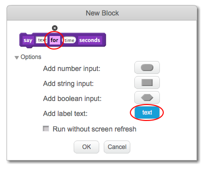

## Making a block with parameters

+ Click on 'More Blocks' in the Scripts tab, then click on 'Make a Block'.

+ You can create blocks that have 'gaps' to add data. These 'gaps' are called __parameters__. To add parameters, first click the type of data you want to add and then give your data a name.

+ If you want to add some text between parameters, you can add label text:

+ You can then define your new block. You can use the data provided by dragging the circular blocks to use them in your code.

+ You can then use your new block, adding data as parameters into the gaps.

+ The code attached to the 'define' block is run whenever your new block is used, using the data provided.

